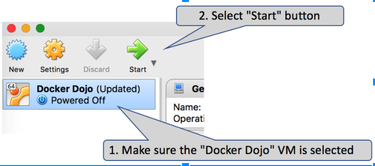
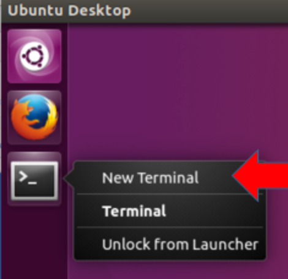
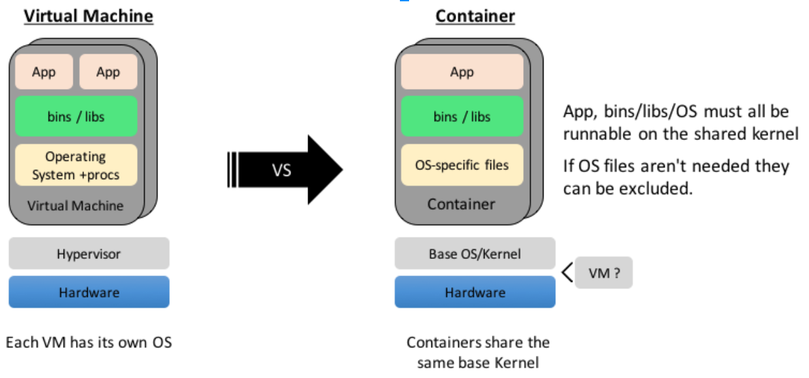
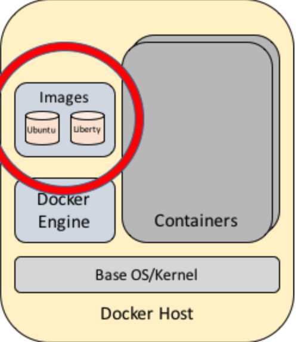
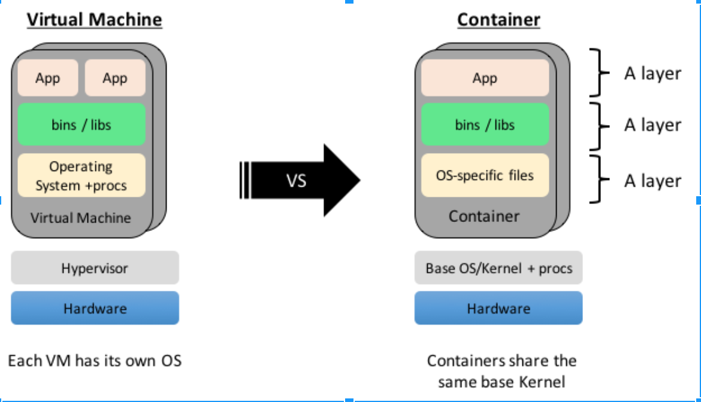
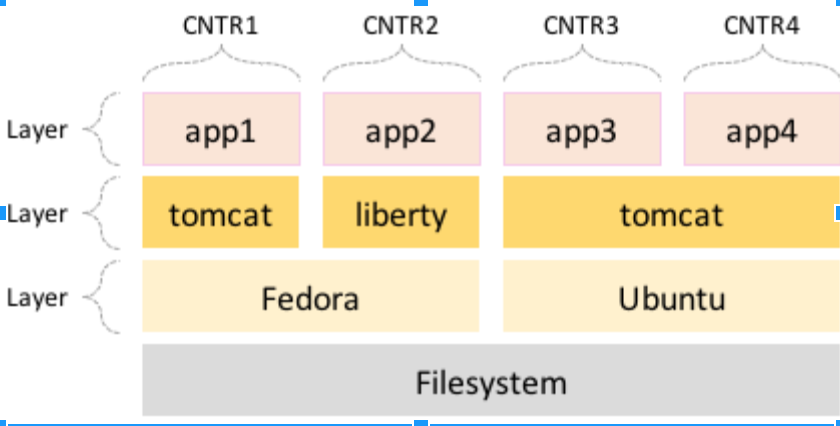
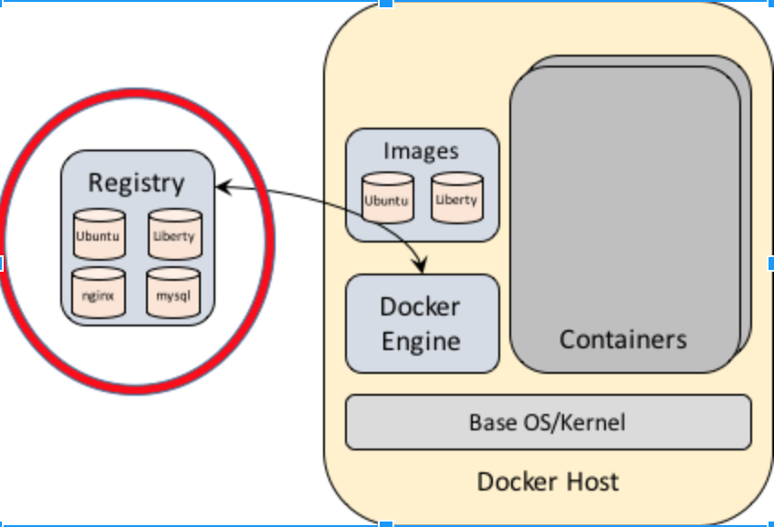
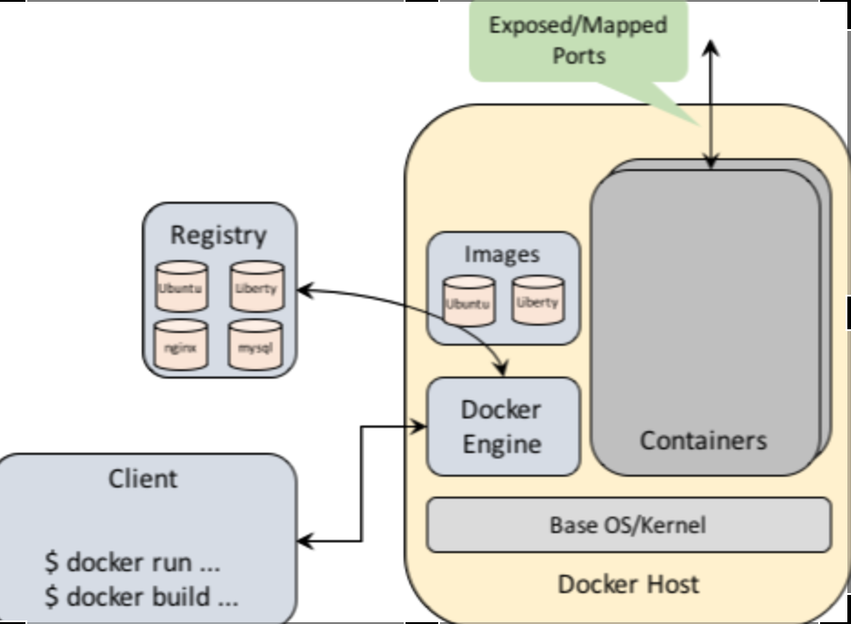

# docker-dojo

## Introduction

The PDF that accompanies this document can be found [here](images/docker-dojo.pdf "Docker Dojo all").

This document will walk the reader through a quick overview of Docker. It is not meant to be a complete deep dive of the technology, rather it is meant to provide enough background to enable the reader to continue their education on their own without feeling lost by the basic concepts or reasoning behind why Docker was designed the way it was.

At the end of this document are some exercises that should help the reader continue their education by trying to solve concrete problems - sometimes leveraging what they learned in this document, other times asking them to explore some newer features on their own.
Conventions used
During this workshop you will be asked to execute certain commands in the terminal (command) window on the Ubuntu system you’ll be using. This will be shown within this document by first showing you the command you should type (in bold), followed by some sample output (not in bold). For example:

```
$ echo Hello World
Hello World
```

In this case you should type “echo Hello World”, and will see “Hello World” printed to the screen. Notice that the “$” is the command prompt, this should not be typed.

### Setup

#### Installing VirtualBox

If you do not already have a hypervisor installed on your machine, you should consider downloading and installing VirtualBox from: [https://www.virtualbox.org/wiki/Downloads](https://www.virtualbox.org/wiki/Downloads). The latest version should work.

#### Installing the VM into VirtualBox

This workshop will use a pre-built virtual machine (VM) image that already has Docker, all of the sample code snippets and demo scripts pre-installed. The following instructions will walk through the process of installing the VM into VirtualBox, but if you have another hypervisor (such as VMWare) then that should work as well.

First, download the “Docker Dojo.ova” VM image from: [https://ibm.box.com/v/DockerDojoVMImage](https://ibm.box.com/v/DockerDojoVMImage). The .ova is 5.6GB in size, so it may take a few minutes. 

Next start VirtualBox and follow these steps:

1. Choose “Import Appliance” from the “File” menu
2. Select the Docker Image.ova file you downloaded
3. Verify the following configuration properties of the image:
⋅⋅* At least 2 CPU
⋅⋅* At least 2000 MB of RAM
4. Press Import

You can now start the VM:




#### Using the VM

You shouldn’t need to do anything special with the virtual machine such as extra setup, but there are a couple of thing to know in case you need them:
* All of the passwords for the VM are “docker”.
* The userid you’ll be using is called “user”.
* To get a new “terminal” (command prompt) window right/two-finger click on the “terminal” icon, and choose “New Terminal” from the pop-up menu. You may also press the Windows key or click the Application icon and type "terminal" in the prompt. 



#### Verify VM Install

To verify that the VM is installed and setup correctly, from a new terminal window try the following:

```
$ docker version
Client:
 Version:      1.13.1
 API version:  1.25
 Go version:   go1.6.3
 Git commit:   8eab29e
 Built:    	Thu Feb 28 23:54:00 2016
 OS/Arch:  	linux/amd64
Server:
 Version:      1.13.1
 API version:  1.25
 Go version:   go1.6.3
 Git commit:   8eab29e
 Built:    	Thu Feb 28 23:54:00 2016
 OS/Arch:  	linux/amd64
 ```

The exact version numbers and dates shown may be different, but that’s ok. As long as you didn’t get any error message then everything is working.

### Preface

#### Our goal: Learn about Docker

The purpose of this workshop is to provide an overview of Docker. It is not meant to be a complete, in-depth, education course. However, it should provide you with enough basic understanding of how Docker works to feel comfortable to explore the remainder of Docker on your own without feeling lost.

While working through these exercises you should be asking yourself a few questions:
* Does Docker make the DevOps end-to-end experience better?
* How can a customer’s existing workflow leverage this technology?
* Can we do this with VMs?

The point here is to get you to think not just about whether Docker itself is an interesting and fun tool, but also how it can be used to solve existing problems. Does it solve them better than the tooling you and your customers are already using?

And, if you are working through this as part of an interactive workshop, please ask lots of questions!

### Introduction to Containers and Docker

#### What is Docker?

At its core, Docker is a set of tools to manage containers. Docker is not a technology, it’s a tool or platform. This is very important because many people consider Docker to have invented “containers”, when in fact containers have been around for a very long time. What Docker did do is simplify access to the technology and enable it for the masses.

However, before we can dive into Docker itself, let’s first discuss what “containers” are.

#### What are Containers?

A container is a group of processes that are executed in isolation from other processes on the host. This isolation is similar to what you get from running virtual machines, except in the virtual machine case the isolation is provided at the “operating system” level, where with containers it’s at the “process” level.

Because the isolation is at the process level, this means that the host’s kernel can be viewed as being shared across all containers/processes. This, in turn, means that all processes that make up a container must be able to run on that shared kernel. In other words, you can not run a Windows container on a Linux host/kernel.

The isolation that is provided by the kernel is done using what is known as “namespaces”. Think of namespaces as a mechanism by which each container sees only its private, or version, of the resources associated with that namespace. For example, each container will have its own set of the following namespace:
* PID - process IDs
* USER - user and groups IDs
* UTS - hostname and domain name
* NS - mount points
* NET - network devices, stacks and ports
* IPC - inter-process communications, message queues

In addition to those namespaces, most container orchestration systems will also use a kernel technology called “cgroups” which is used to control the amount of these resources available to each namespace and to monitor those resources.

And finally, each container will also typically be provided its own root file system. This allows for each container to see only the files related to that container and to prevent that container from modifying files on the host or other containers.

### VMs vs Containers

As previously mentioned, containers have similar properties to virtual machines in that they both provide isolation to the applications being executed. The biggest difference is that with VMs, the application has its own operating system running. With containers, just the application code is running and there really is no operating system - unless the container goes out of its way to start some operating system services within itself.

Let’s compare VMs and container a bit more by looking at the following picture:



On the left side we see a typical VM setup. Starting at the bottom we have the hardware (host), the hypervisor that will manage the VMs, and then we have a set of VMs. Within it we’ll have the operating system and its processes, perhaps some shared binaries/libraries and finally one or more applications running. 

Compare that to the container model on the right. Again, we start with the hardware and a base operating system/kernel, which really just runs the container orchestration engine itself. Note that we can run the container orchestration engine directly on the hardware (bare metal), or we could choose to have a virtual machine in the picture if you choose, but it is not necessary. Above the kernel we then have the set of containers. Within each container you’ll find the application and any binaries/libraries it needs to function. While the picture shows “OS-specific files”, those are totally optional. If the application does not need them then they can be excluded, which occurs in many cases. This means that often containers will be just the executables of the application and nothing more.

#### Why Containers?

A few times now we mentioned that containers are similar to VMs, so the natural question to ask then is why should we use containers?

There are a few key reasons, the first being start-up time. When thinking about starting up a VM you must first allocate space on the hardware for the VM, start the operating system and all of its services, and then start the application. With containers the amount of setup needed is far less.

To start a container, the container orchestrator will need to:
* Create the directory representing the container’s private file system
* Lay-down the saved container’s file system into that directory (if needed)
* Setup the networks, mounts, etc.
* Start the application

Typically all of this can be done in milliseconds rather than minutes or more as you can often see with virtual machines. In fairness, virtual machine startup times are getting faster so we may see this difference be less of an issue in the future.

The second reason to use containers, which is related a bit to the first, is that it provides better resource utilization. Since a container doesn’t have an entire operating system associated with it (from a disk space perspective and number of processes running) we can fit a lot more containers per host than we can virtual machines; typically orders of magnitude more. That can be quite a cost savings for the user.

#### What is Docker Again?

So, with that knowledge of containers, let’s revisit Docker and explore what it provides us beyond what the core kernel does.

Remember that Docker is just a tool to manage containers. So, while the base kernel can create a container (processes and the namespaces to provide isolation), Docker will be responsible for all of the setup needed before and after the kernel does its job, as well as provide all of the configuration options to the kernel to start the container properly.

Docker will create and manage the lifecycle of containers by doing the following:
* Setup the file system for the container
* Create the container
* Setup the networks
* Setup the volumes and mounts
* Start the container’s process, telling the kernel to run it in isolation

When done, it will undo all of the above

#### Our First Container
With that base knowledge of containers and Docker, let’s start to actually use it. Within a terminal window run the following:

```
$ docker run ubuntu echo Hello World
Hello World
```

Let’s talk about what happened here:

* First Docker created a new directory for our container’s file system and copied a “ubuntu” file system (also known as a Docker “image”) into it
* Docker, via the kernel, create a new set of namespaces for our container
* It then ran a new process (“echo Hello World”) within the container:
⋅⋅* Using those namespaces to isolate it from other containers/processes on the host
⋅⋅* Using the new directory as the “root” of the file system (think “chroot” for those who know Linux)

That’s it. Notice that we never actually installed Ubuntu. We used a previously created Docker “image” which had the Ubuntu file system already in it - you can think of this as the Docker equivalent of VM images. However, while the container did have the files from Ubuntu no Ubuntu processes were ever started in the container, aside from “echo”. In particular no system processes. This means that, technically, the image we used to run “echo” is probably a lot more than what we needed, but that’s ok for now and we’ll explore how to deal with that later.

Run the docker command again and notice how quickly it runs. Each time Docker is creating a brand new container. Imagine how long that would take with virtual machines, or how much work it would take to actually create and start a virtual machine. Could you even start a trivial process like “echo” in a virtual machine and only see the output as if “echo” were run from your current command line?

### ssh-ing into a container - fake it…

Now let’s start another container, but this time instead of simply running a command we’re going to actually go into the container, similar to using “ssh” to enter a VM:

```
$ docker run -ti ubuntu bash
root@62deec4411da:/# pwd
/
root@62deec4411da:/# exit
$
```

Similar to our previous “echo” example, this will create a “ubuntu” container and run a command, this time its “bash” though. The “-ti” options are there to tell Docker to connect stdin from our command line to the container’s stdin, and to setup a “tty” - we need that in order for stdin processing to work correctly.

Once you hit enter you should be given a prompt from the “bash” command. Notice the prompt shows your username as “root” and the hostname as some unique/random ID. This is because the namespaces that have been setup have created, in essence, a new/unique view of the system. Within the container you are not the same user you were from the old command line - you are really “root”, with “root” privileges, but just while in the container. Likewise, the hostname is no longer “docker”, as it was in the normal terminal environment. From inside the container you have a new networking stack with a new hostname, the unique ID shown.

As long as you’re still in the container go ahead and look around and do whatever you want. You won’t hurt anything outside of the container. For example, you can delete “/etc/passwd” if you wanted and that change is only going to impact the container because it has its own file system that is distinct from the host’s. When you type “exit” you’ll shutdown the container and return to your normal, untouched, host environment. Just make sure you’re in the container when you play around!

This simple example shows how you could have the same net effect of ssh-ing into a container, but without the need to actually start the “ssh” daemon process. All you need is to ensure that the “bash” executable is available in the container. This is a very important point and difference between containers and virtual machines. One of the biggest security risks with virtual machines are all of the extra system processes that are running (even unknown ones to the application owner) that may be leveraged by hackers. With containers those extra process are not running unless you explicitly ask them to be, and in some cases (like “ssh”) you may not need them at all because Docker offers a more secure way to get the same result.

### A look under the covers

Let’s look at one more example to help solidify the isolation that containers provide:

```
$ docker run ubuntu ps -ef
UID         PID   PPID  C STIME TTY          TIME CMD
root          1      0  0 14:33 ?        00:00:00 ps -ef
```

If you are not familiar with Linux, the “ps -ef” command will show all of the processes running in the environment.

A couple of thing to notice about this:

* From the container’s point of view it only see its own processes, which in this case is just the “ps -ef” command and nothing else.
* The command is running as “root”, as we also saw in the previous example.
* Its process ID (PID) is “1”. This is important because for those who know Linux you’ll know that when a Linux system starts the “init” (main) process always gets assigned a PID of “1”, and when that process dies so does the operating system. Same for containers. When PID “1” in a container dies so does the container. Again, showing how similar containers and VMs are. This is also very important because with Docker you can start additional processes within the container. They can start and stop without any impact on the state of the container. But once PID 1 stops, all other processes will stop as well and the container still shutdown - even if those additional processes are running.

We’ve now covered the very basics of containers, hopefully you can appreciate why Docker is so popular. Even with these trivial examples we’ve shown how easy Docker makes it to use this exciting technology, while still providing the security and flexibility needed to get your job done. In future exercises we’ll explore more advanced feature that Docker offers but for now let’s talk about those Docker images we’ve mentioned.

#### Docker Images

A Docker “Image” is nothing more than a tar file (for those not familiar with Linux, think of it as a type of “zip” file) of the file system from a container - plus a little bit of extra metadata. As previously mentioned, this is similar to virtual machine images.

The purpose behind a Docker Image, like VM images, is for sharing and redistribution. It allows for you to create new containers with a custom file system without having to reconstruct it each time a new container is created. In essence, instead of having to “install” all of the various programs/files, Docker will just copy the files (the entire file system) from the Image into your new container.

To help with the “sharing” aspect of Images, and to help the container community leverage each other’s work, Docker Inc (the company that created Docker) hosts a public global Image registry called “DockerHub”. This site (https://hub.docker.com) is free for anyone to use as along as the images you upload are freely available for anyone to download. You are however given one “private” image if you need it. Beyond that, if you want more private images then you need to pay for it.

The benefit of DockerHub, and one of the reasons Docker has become so widely used, is that just about any software package that you can think of (in particular, open source projects) are available from DockerHub. No need to compile or install anything, just do “docker run” with the Image name and Docker will automatically download it to your host and run it. It doesn’t get any easier than that!

Focusing on this “downloading of Images” aspect for a moment. Let’s look at how a host system looks when Docker is being used:




Starting as the bottom, we have the operating system/kernel which needs to be there, if nothing else, to just run the Docker Engine. We then have the Docker Engine running, which is managing the set of containers on that host. And finally, we have the stuff in the red circle, which is our “Image cache”.

Whether you download an image from DockerHub or build a new image directly on this host, Docker will keep a set of those images locally on this host so that you when you start a new container based on one of those images it can use the cache and not have to download the image each time. A very key optimization when you need to quickly startup containers. And, in fact, in the examples we’ve done we leveraged the “ubuntu” Docker Image from the cache each time - that’s why the commands were so fast. If you erased it from the cache then the commands would still work but you would have had to wait for Docker to download the “ubuntu” image from DockerHub first.

#### Docker special sauce: Layers

Overall, for our purposes you can just think of Docker Images as the container version of virtual machines images. However, Docker does add some “special sauce” to their images, but before we get into that let’s revisit the difference between VMs and containers by looking at a previous picture, but with a few minor tweaks:



Overall, the picture is the same as what we’ve seen but notice on the right side each set of files that might appear in the container is now called a “layer”. As you build up the contents of a container, to build an image, you can tell Docker to snapshot what’s currently there into a “layer” so that as you add more files those new files will be in a new layer. While this may seem like just an interesting implementation detail that you don’t need to think about, let’s look at another picture to explain why this may be important to you:



In this picture we have 4 different containers (CNTR1 through CNTR4). Let’s focus on the first 2. Notice that from a “layer” perspective it shows that both share a “Fedora” layer but then each has their own additional layers (“tomcat” vs “liberty” and “app1” vs “app2”) that are added on top of it. What this means is that when CNTR1 was built it started with Fedora, then tomcat was added and finally app1’s files were added - creating “layers” after each one. Likewise, the same thing was done when building CNTR2.

Docker is smart enough to detect that the same Fedora layer (or image) was used in both cases and rather than downloading two instances of the same Fedora image it only downloaded it once and used it for both containers. It does this by leveraging something known as a “union file system” which will take a set of directories and virtually merge them all together and present the net result as a single file system.

What this means is that Docker will merge Fedora, tomcat and app1’s files (virtually) and the final result will then be available to CNTR1 container. If that container makes any changes to the file system (updates or deletes) then those are only done within the context of an additional directory (layer) that was created exclusively for that container so that any other container leveraging the lower layers will not see those changes - known as a copy-on-write file system. In essence, all layers except the top-most one are read-only - making them available for reuse.

Looking at the other example in the picture we can see that containers 3 and 4 share not only the Ubuntu image/layer, but also the tomcat layer. This sharing of layers, along with the union file system allows Docker to really optimize the disk usage of a host. Its very important to reiterate that this sharing is done just at the file system level. When containers 3 and 4 share tomcat, they are sharing tomcat’s files, NOT a running instance of tomcat. Each container will have their own tomcat process running.

This sharing of layers and use of a union file system also allows for a faster startup times because Docker doesn’t need to actually copy each image into a new directory to create a unique version for a new container, it can just reference the one instance of it by using the union file system mechanism.

#### Docker Registry

We briefly discussed the Docker Registry known as DockerHub (https://hub.docker.com), but let’s reiterate some points and cover some new ones.




While creating and reusing images for your own use is important, sharing them with other people (whether they’re on the internet or just within your own organization) is also very important. For example, being able to share Images as part of your CI/CD pipeline or as your software distribution mechanism will greatly simplify your (and your consumer’s) workflow.

Docker already knows how to talk to registries. And by default it will look in DockerHub for an image if it can’t find it locally in the cache, but you can also tell it to explicitly look in other registries if needed.

To cover some of the main points about DockerHub again:
* It is a public registry for storing and sharing of Docker Images
* It's Hosted by Docker Inc
* It is free for public images but you get one free private image before you have to pay
* By default all Docker engines will try to look in DockerHub for images
* It has a browser interface for searching and reading the description of images

#### Multi-Architecture Support

While we’ve talked about how all containers that run on a host must be able to leverage the base kernel installed on that host, we didn’t really say anything about the architecture of the hardware itself - even though it should be obvious that it needs to match as well.

Initially, Docker was primary designed for Linux Intel x86 machines and as a result many of the images you’ll find in DockerHub will only work on those machines. However, now Docker has been enhanced to also support other architectures such as Power, Z and ARM. And not just Linux, but Windows as well.

What is referred to as “Multi-Architecture” support is now available. What this means is:
* The Docker engine will only look for images in the registry that matches the architecture and operating system of the host running the engine
* Docker Images now support the idea of having more than one architecture and OS version within it. This allows you to refer to an image as “foo” and the engine will find the proper version of “foo” for your host/architecture - if it is available.
* While the Docker command line doesn’t expose tooling to create multi-arch images yet, it is in the works.

#### Docker Component Overview

Before we wrap up this section, let’s look at the complete picture of the Docker architecture:




To reiterate what we’ve learned so far:
* Each Docker Host will have a Docker Engine running that manages the containers on that host.
* It will accept requests to manage the containers from a Docker client. That client can actually be on the same host or remote, as it just uses an HTTP API.
* The Docker client is the main “driver” for the Docker engine and can be used to not just manage containers but to build new images - which we will discuss later.
* The engine will also manage the ports exposed by each container. Each container can tell Docker which ports to be visible outside of the container and it needs to tell Docker which ports on the host to map to each exposed container port. Note that since only one container can use a single port (e.g. 80) on the host, when the container is listening on port 80 its requests might actually be delivered to the host on port 3582. We’ll talk more about this later.
* There are Docker Images, which are used to populate new containers, and there’s an image cache on each host to speed up container creation times.
* Finally, we have the Docker Registry that can be used to share Docker Images.

#### Summary

To wrap up this section, let’s summarize what we’ve learned:
* Docker is just a tool to manage containers - it is not a technology itself
* Key concepts
** Containers, Docker Engine, Images and Registries
* Docker’s value add
  * An excellent User Experience
  * Image layers
  * Easily shared images via DockerHub
* Why? When compared to VMs
  * Better resource utilization - CPU, Memory and Disk
  * Faster startup times
  * Easier tooling/scripting via the Docker CLI

In the next section we’ll dive into the process of creating a devOps pipeline, which means the first thing we’ll need to do is create new content that can be tested and delivered to our users.

### DevOps Enablement: Configuration Management

In this section we’re going to discuss how Docker makes it easier to manage our environments - whether it be our developer's environments, our CI/CD pipeline, or the environment in which our applications will run once in the hands of our users.

Ensuring that developers and each stage of our CI/CD pipeline have the correct environment can be a challenge. It is too easy to have variants introduced based on who, and when, things were installed. Often developers might have a different version of operating systems, tools or libraries from the rest of the pipeline or the customer. Docker, and containers, help with this.

#### Scenario

Let’s see how Docker helps by walking through a concrete example: a new developer has joined the team, how can Docker help?

First, the developer is provided a new laptop (or VM) with Ubuntu and Docker installed - that’s the baseline from which all developers will start. From there they will probably grab the latest version of the software product by doing a “git clone” of the source code from the git repository. In our VM you’ll see the result of this in your “~/myapp” directory.

Our challenge is to get them up and running as quickly as possible so they can be productive. Ideally, we’d like to do this without the need to go through the normal (painful) process of installing all of the various compilers, libraries, testing tools, etc. that people might normally need to hunt down and spend hours installing and configuring.

#### The Setup

Go ahead and “cd” into the “myapp” directory to see the source code of our fictitious project:

```
$ cd myapp
```

And let’s look at the Makefile (for those who don’t know about Makefies, they are just the list of instructions to build our project):

```
$ cat Makefile
myapp: myapp.go
   go build -tags netgo -installsuffix netgo -o myapp myapp.go
```

There's nothing here about Docker, just a normal compile step. So, let’s go ahead and try to build it:

```
$ make
go build -tags netgo -installsuffix netgo -o myapp myapp.go
make: go: Command not found
Makefile:2: recipe for target 'myapp' failed
make: *** [myapp] Error 127
```

Notice that it failed because we don’t have the “go” (golang) compiler installed. This makes sense since we didn’t install anything yet. So, what’s the solution for this? Our IT department has provided us a Docker image called “golang”. This image has the go compiler already installed so we can use that to do our build.

Before we show how to do that, let’s first discuss what we’re going to do:
* Create a new container using the “golang” image
* Make our source code available inside of the container so it can build it
* Build the application, in the container
* Make the resulting executable available outside of the container, otherwise the results will be lost when the container is deleted

One important thing to note here is that normally the IT department would have already modified the Makefile in the way we’re about to describe so that the developer didn’t need to do any of this. But for education purposes, it’s important to show the steps.

Looking at the output from our “make” command we can see that the command we would like to use to compile the program is:

```
go build -tags netgo -installsuffix netgo -o myapp myapp.go
```

So, based on what we learned before about Docker we might try something to just run that command in a “golang” container like this:

```
docker run golang \
    go build -tags netgo -installsuffix netgo -o myapp myapp.go
```

And that’s partially correct, that will start a new container based on “golang” and execute the “go build” command. However, remember that the file system of that container is just whatever the “golang” Docker image had - which means it doesn’t have our source code. In order to fix that we can tell Docker to “mount” our source code (the “src” directory) into the container. Then those files will be available to all processes executed in the container. So, the command in the Makefile will now look like this (as seen in Makefile1):

docker run -v $(PWD):/src golang \
    go build -tags netgo -installsuffix netgo -o myapp myapp.go

Note: The “$(PWD)” is Makefile syntax for using the “PWD” environment variable’s value. You are not expected to run this command yourself on the command line (which is why it’s not in bold), but if you really want to try it then replace it with “$PWD”, no parens.

The “-v $(PWD):/src” tells Docker to mount a volume (the “-v” flag) into the container. The other argument tells it the source of the mount (the current directory, $(PWD)) and the location in the container to mount it, “/src” directory. Any pre-existing files at that location in the container will be hidden by this operation.

So, that’s good. We can now see our files in the container, but there’s one last step. We need to tell Docker which directory we want the command to be executed in. In other words, since our “myapp.go” file is now visible in the “/src” directory, we should “cd” to that directory first before we run the “go build” command. We do this with the “-w” flag on the “docker run” command - that tells docker what the “working directory” should be:

docker run -v $(PWD):/src -w /src golang \
  	go build -tags netgo -installsuffix netgo -o myapp myapp.go

And that’s the complete command. Let’s summarize what we learned:
“docker run golang” will create a new container based on the “golang” image
“-v $(PWD):/src” mounts the current directory into the container at “/src”
“-w /src” tells Docker to “cd” to “/src” before starting the process

Notice that we didn’t really modify the normal developer’s process, we just wrapped what they would normally do with a Docker command.

It’s important to know that the “-v” flag requires that the paths you specify are absolute paths and not relative. This is why we could not use “.” (current dir) in the command, and had to use “$(PWD)” instead.

One last point… where does the output from the build go?

Because of the “-o myapp” flag we can see that the compiler will put the result in a file called “myapp” in the current directory - which is “/src”. But because “/src” is mounted from our current directory on the host, it should end up in that same current directory from which we ran the “make” command - outside of the container. Let’s try it and see by using “Makefile1”:

$ make -f Makefile1
docker run -v /home/user/myapp:/src -w /src golang \
  go build -tags netgo -installsuffix netgo -o myapp myapp.go

If you look in the current directory you should see “myapp” there:

```
$ ls -l
total 5584
-rw-r--r-- 1 user user      44 Sep  3 11:27 Makefile
-rwxr-xr-x 1 root root 5706234 Sep  4 06:51 myapp
-rw-r--r-- 1 user user     887 Sep  3 11:39 myapp.go
```

### Test the Build

Now we can run the program just to verify that it works:

```
$ ./myapp 8080
Will show:
<pre><b>v1.0 Host: docker  Date: 2016-09-04 05:27:42.582058185 -0700 PDT</b>
127.0.0.1
192.168.59.147
172.17.0.1
172.19.0.1
172.18.0.1
172.20.0.1

Listening on: 0.0.0.0:8080
```

You can see that this is just a very simple HTTP server, and any request sent to it will return the date and the list of IP addresses associated with each network interface.

From another terminal window you can test it by using the following command:

```
$ curl localhost:8080
<pre><b>v1.0 Host: docker  Date: 2016-09-04 05:27:42.582058185 -0700 PDT</b>
127.0.0.1
192.168.59.147
172.17.0.1
172.19.0.1
172.18.0.1
172.20.0.1
```

And to stop the program, just press “control-c” in the first window.

### Summary

In this section we’ve shown how Docker can be used to ensure we have the same environment throughout our entire development pipeline. By having a shared set of Docker images we can ensure that everyone will use the same version of each tool and dependency all the way through the process. Additionally, developers, testers, etc. do not need to waste time installing or tracking updates - it’s all managed centrally by the owners of the specific images being used.

All new people needed to do in advance is:
Have a VM + Docker installed
Download the source code: e.g. git clone ...

Organizations can now have better control, and reduced burden, with respect to management of their configurations and environments. 

#### Discussion Point #1

There are some aspect of this scenario that were ignored, let’s discuss them. First, notice that the owner of “myapp” is not the same as the rest of the files:

```
$ ls -l
total 5584
-rw-r--r-- 1 user user      44 Sep  3 11:27 Makefile
-rwxr-xr-x 1 root root 5706234 Sep  4 06:51 myapp
-rw-r--r-- 1 user user     887 Sep  3 11:39 myapp.go
```

Notice its “root” that owns “myapp”. This is because from inside of the container we were running as “root”. Specifically, the user ID of the user was “1” in the container, so the output file was assigned the same user ID and back on the host it maps to “root”. In order to fix this we would need to tell Docker to run the “go build” process under the same user ID that we use on the host, meaning user ID “1000” (that’s the ID for user “user”). We could do this by modifying the Makefile like this:

```
docker run -u 1000:1000 -v $(PWD):/src -w /src golang \
      go build -tags netgo -installsuffix netgo -o myapp myapp.go
```

Notice the “-u 1000:1000” flag. That tells Docker to set the user ID and the group ID of the process to “1000” when it executes the command. You can try this yourself by running “make” using “Makefile2” - but you’ll want to remove “myapp” first:

```
$ rm -f myapp
$ make -f Makefile2
docker run -u 1000:1000 -v /root/src/github.com/ibm-dojo/myapp:/src -w /src golang \
  go build -tags netgo -installsuffix netgo -o myapp myapp.go
```

#### Discussion Point #2

You might be wondering about the claim that all we needed to provide to a developer was a clean Ubuntu machine with Docker installed, but then we talked about cloning the git repo that had the source code. Doesn’t that mean we need git installed too? Try this command:

```
$ which git
```

The result should be empty, meaning there is no “git” command in the PATH. What’s going on? Let’s look a bit deeper and ask the shell what “git” maps to (note the capital “V”):

```
$ command -V git
alias git='docker run -ti -u 1000:1000 \
    -v /home/user:/tmphome -v $PWD:/wd \
    -w /wd -e HOME=/tmphome git'
```

The “git” command is aliased to run a docker container! Let’s walk through each of those arguments and explain what’s going on:
* `-ti`  will connect stdin on the host to the container, and setup a tty
* `-u 1000:1000` tells Docker to run the process as “user”
* `-v /home/user:/tmphome` will mount our $HOME dir into the container at /tmphome
* `-v $PWD:/wd` will mount the current directory as /wd in the container
* `-w /wd` will “cd” to /wd before running the process
* `-e HOME=/tmphome` set the environment variable “HOME” to “/tmphome” in the container before running the process. This is needed so that git will find the $HOME/.gitconfig configuration file.
* git   is the command that is executed in the container, and any argument put after the “git” command on the command line will be appended to the end of the “docker run” command, meaning git in the container will get them.

That’s a lot of options, but for most situations it will work. The point of this little trick is to show you that using containers/Docker isn’t just for running “real” enterprise applications that are intended to act as microservices. Of course that's a great use, but Docker can also be used to simply run any command you want on your host without having to actually install it. As long as it can be put into a Docker image you can run it just as if it was installed locally - just without the installation headaches. Not sure you can do that with virtual machines. Try to consider what other programs you might want to run this way.

#### DevOps Enablement: Building Value

In this section we’re going to explore how a developer can add value by creating new Docker images that can then be shared with others - either other users or for future steps in the CI/CD pipeline.
Scenario
A developer has built an application, in this case “myapp”, and they now want to share it with the rest of the CI/CD pipeline. It should be obvious that we’re going to do this by building a Docker image for this application and then share it with a Docker registry.

Before we begin, let’s first make sure your version of “myapp” exists and is built properly (make sure you’re in the “myapp” directory):

```
$ rm -f myapp
$ make -f Makefile2
docker run -u 1000:1000 -v /home/user/myapp:/src -w /src golang \
  go build -tags netgo -installsuffix netgo -o myapp myapp.go
```

#### Creating a Docker Image - Manually

There are multiple ways to create Docker images, we’re going to explore two possible ways - first the manual way, and then we’ll step through the more proper, automated, way to do it.

The manual way involves creating a Docker image by “snapshotting” a container that has the file system setup the way we want. To do this we’re going to follow some relatively simple steps.

Step 1: create a new container for our application:

```
$ docker create ubuntu
5ed983843bbaef1062096e456e6fd931e6f24e9399d7c801adc7f
```

Note the result is some unique identifier. This is the ID of the container and how we’ll reference it. When you reference a container by ID you’ll only need to specify enough characters to uniquely identify it from any other container.

Step 2: copy the application into it:

```
$ docker cp myapp 5ed98:/myapp
```

Here the “docker cp” command should look similar to the “scp” command you may have used. The first argument is the file you want to copy, while the second argument is the destination container followed by a colon (:) and the location in the container to place the file. So, in this case we’re copying “myapp” to the root of the file system of the container.

Step 3: snapshot the container as a Docker image called “myapp”:

```
$ docker commit -c "entrypoint /myapp" 5ed98 myapp
sha256:7c640789dae5607c868a56883189d6c72478eff1080a67
```

In this command we’re using “commit”, which is the Docker snapshot (or image create) command. The “-c entrypoint /myapp” flag adds metadata to the resulting image that will tell Docker what command to execute by default when a new container is created from the image. In this case we want it to run “/myapp”. The next argument is the container we want to snapshot, and finally we give the name of the Docker image we to create, “myapp”.

And that’s it.

#### Test the Image

Now that we have a new image, let’s test it. We’re going to run it the same way we did the previous Docker commands:

```
$ docker run -ti myapp
Will show:
<pre><b>v1.0 Host: 165dcbc3e6f8  Date: 2016-09-05 02:47:50.2...</b>
127.0.0.1
172.17.0.2

Listening on: 0.0.0.0:80
```

And, in another window try to hit the server using the “172.” IP address - that’s the IP address of the container as seen by the host:

```
$ curl 172.17.0.2
<pre><b>v1.0 Host: b8d73b85cc04  Date: 2016-09-05 02:53:49.803922...</b>
127.0.0.1
172.17.0.2
```

We’ve now successfully create a new Docker image containing our application and verified that it does in fact work as expected via “docker run”. You can now stop the container in the first window by pressing “control-c” in that window.

#### Discussion

In the previous exercise we ran our application in a container and accessed it by talking directly to the container’s IP address. This is fine when we want to access it from this machine, but what if we want to access it from a remote host? Can we expose this container at the “host level” so that others can access it?

Yes. If you remember in our introduction section we talked about one of the the jobs of the Docker engine is to map ports from the host to ports within the container - that’s what we need to do in this case. For our example, what we need to do is map port 80 in the container to some unique (unused) port on the host:

```
$ docker run -d -ti -p 9999:80 myapp
4b08d035deb6135eff60babd1368ab47c0c1f1d09a8ddf3f9417e7e4c4
```

There are two new flags being introduced here. First the “-d” flag - that tells Docker to run the container in the background (as a daemon). That’s why we didn’t see the normal output from “myapp” and instead we see the ID of the resulting container (4b08… in this case). This is so that we can refer to it later - like when we want to stop it.

The second new flag is “-p 9999:80”. This tells Docker to map port “9999” on the host to port “80” in the container. This means that any incoming request sent to this machine on port 9999 will automatically be routed to port 80 of this new container. It’s important to note that even though to the outside world they will access the application on port “9999”, the processes inside the container will see the request on port 80.

We can test this by trying to connect to our machine at port 9999:

```
$ curl localhost:9999
<pre><b>v1.0 Host: 4b08d035deb6  Date: 2016-09-05 03:14:31.713...</b>
127.0.0.1
172.17.0.2
```

And it worked. Now we can stop and delete the container using the “docker rm” command and referencing the container ID returned from the “docker run” command:

```
$ docker rm 4b08
Failed to remove container ...
```

It failed! This is because by default Docker will not let to delete a container that is still running. We can, however, force it by adding the “-f” flag:

```
$ docker rm -f 4b08
4b08
```

#### Creating a Docker Image - With Docker Build

Now that we’ve seen how to create a Docker image by snapshotting a container that we built up manually, let’s see the more proper way to do it.

Docker provides a “build” feature that is specifically designed for this purpose. It uses a file called “Dockerfile” as the list of instructions for how to construct the image - not unlike how a Makefile contains the list of instruction on how to perform some tasks. Let’s look at the Dockerfile that is provided for you in the “myapp” directory:

```
$ cat Dockerfile
FROM ubuntu
ADD myapp /
EXPOSE 80
ENTRYPOINT /myapp
```

We’ll explain each line of this file by also looking at the output of the “docker build” command at the same time. So, let’s build it (note the period (.) at the end, that’s very important):

```
$ docker build -t myapp .
Sending build context to Docker daemon 5.767 MB
Step 1/4 : FROM ubuntu
 ---> ff6011336327
Step 2/4 : ADD myapp /
 ---> b867e19a859b
Removing intermediate container ea699ecc51a0
Step 3/4 : EXPOSE 80
 ---> Running in 85c240f03ae9
 ---> 5d8e53bbf9e4
Removing intermediate container 85c240f03ae9
Step 4/4 : ENTRYPOINT /myapp
 ---> Running in f318d82c2c38
 ---> 684c6c2572ff
Removing intermediate container f318d82c2c38
Successfully built 684c6c2572ff
```

Looking at each step:

```
$ docker build -t myapp .
```

As you might have guessed, this is the command to build an image. The “-t myapp” flag tells Docker what to name the resulting image, in this case “myapp”. The “t” stands for “tag” - just an alias for “name”. The period (.) at the end tells Docker where to find the input to the build - in this case the current directory.

```
Sending build context to Docker daemon 5.767 MB
```

When doing a build, Docker will grab all of the files from the directory you pointed it to (“.” in our case), and send it to the Docker engine - it calls these files the “build context”. And in our case the total size of our build context is around 5 megabytes.

Once the build context is sent, the engine will unpack it into a new directory and now those files are available to the build process, as/if needed.

```
Step 1/4 : FROM ubuntu
 ---> ff6011336327
```

Now we’re actually starting to build up our container that will result in the image. Here we’re telling Docker to start with an image called “ubuntu”. Notice that this is the same thing we did in the manual process when we did “docker create ubuntu”.

```
Step 2/4 : ADD myapp /
 ---> b867e19a859b
Removing intermediate container ea699ecc51a0
```

This “ADD” command will copy a file from the current directory (the root of the unpacked build context directory on the engine) to the root of the container’s file system (/). This is the equivalent of the “docker cp myapp 5ed98:/myapp” command we did during the manual process.

There’s also some interesting output here. The “---> b867e19a859b” line tells us the ID of the resulting image from this step. Most steps in a Dockerfile will actually result in a brand new image. If you remember the discussion around Image “layers”, this is how those layers are created - each build step image is actually a layer in the final image. And finally the “Removing…” line tell us that Docker is removing the temporary container it created as part of this build step. Most build steps will actually create a new container using the image from the previous step and then erase it when done.

```
Step 3/4 : EXPOSE 80
 ---> Running in 85c240f03ae9
 ---> 5d8e53bbf9e4
Removing intermediate container 85c240f03ae9
```

Here we’re not actually modifying the file system of any container/image, we’re just added extra metadata to the image. And, in this case we’re telling Docker that we’re going to expect incoming traffic to come in on port 80. This will be useful if we ever ask Docker to automatically map all exposed ports to the host - because the list of ports will be taken from these EXPOSE commands. You can still do the mapping manually (as we did before) if needed though.

```
Step 4/4 : ENTRYPOINT /myapp
 ---> Running in f318d82c2c38
 ---> 684c6c2572ff
Removing intermediate container f318d82c2c38
Successfully built 684c6c2572ff
```

And in this last step we’re doing the equivalent of the “-c "entrypoint /myapp" option we specified on the “docker commit” command - we’re specifying the default command to run when a new container is created from this image. So this is just modifying the metadata of the resulting image.

Notice the “---> 684c6c2572ff” line, like the others tells us the resulting image ID for this step. But, it’s also the resulting image ID for the entire build process since that was the final step. So, we’ve now build a new image whose ID is 684c6c257ff as well as “myapp” based on the “-t myapp” flag we provided. You can technically refer to the image using either the ID or name.

#### Test the Image - With Auto-Port Allocation

Now that we’ve built the image again, using Docker’s build facility, we can test it but this time we’re going to let Docker do the port mapping for us automatically:

```
$ docker run -tidP myapp
469221295fae1b57615286ec7268272e3d3583c12ea66e14b2
```

On this “docker run” command we’re using the “-tid” flags we’ve already discussed, but we’re also using the “-P” flag - notice its capital “P” not lower-case. This tells Docker to automatically map all ports specified by the EXPOSE command in the Dockerfile to a randomly selected port on the host. We can see the port it chose by using the “docker ps” command:

```
$ docker ps
CONTAINER ID  IMAGE  COMMAND          	CREATED     	STATUS
           	PORTS               	NAMES
469221295fae  myapp  "/bin/sh -c /myapp"  4 seconds ago   Up 4
seconds    	0.0.0.0:32768->80/tcp   clever_ardinghelli
```

The “docker ps” command lists the running container on this host. Most of the columns should be obvious, but let’s focus on the “PORTS” column which has “0.0.0.0:32768->80/tcp” in it. This means that Docker has automatically mapped port 32768 on the host to port 80 in the container and will route all “tcp” traffic to it. This saves us the trouble of doing a “-p 32768:80” on the “docker run” command, but the downside is that you’ll need to ask Docker for the port number used since it will be random each time.

One final thing to note is that in the “NAME” column we have a value of “clever_ardinghelli”. If you don’t give a human readable name for your containers Docker will randomly assign one for you.

Now, let’s test it by trying to talk to that host port we saw in the “docker ps” output (note: your port number may be different):

$ curl localhost:32768
<pre><b>v1.0 Host: 469221295fae  Date: 2016-09-05 03:34:49....</b>
127.0.0.1
172.17.0.3

And finally, let’s stop and delete our container:

$ docker rm -f 469
469
Sharing the Image
Now that we know how to build our image we need to make it available in some registry for other people to download it and use it. Normally, you would upload (or “push”) it to some shared registry but for our exercise we’re not going to use a real public registry, instead we’re going to start a registry locally on this VM and push the image to it. You can start the registry via the following command:

$ regStart

Under the covers this command will start a new Docker container running a Docker image registry.
Naming Images
Before we can upload the image we need to modify its name. Each image that is put into a registry must adhere to a certain naming pattern, the general syntax of image names is:

[[registry/][namespace/]]name[:tag]

It indicates that just the “name” portion is required, and while that’s true for images that are just local, you will need more if you want to push it to a registry. Let’s look at each part of this naming schema:
“registry/” - this is the hostname of the registry into which you want to push the image. In our case since we’re pushing it to a registry running on this host (and our hostname is “docker”) we can just use “docker/” for this part of the name.
“namespace/” - in some registries they require you to provide the “namespace” into which the image is placed. Think of it as the account name that will own it. For our case the registry doesn’t have any namespaces so we can leave that off.
“:tag” - this is an optional qualifier for the image. Often this will include the version number of the image. Docker itself doesn’t really do anything with this information other than use it to find the image you want. In particular, it makes no attempt to understand the value you provide. Meaning if you name one image as “myapp:1.0” and another as “myapp:2.0” then while Docker will group those two image together because they share the same base name (myapp), it doesn’t know that “myapp:2.0” is a newer version of the image - aside from the fact that it will most likely have a new timestamp. There is no versioning logic within Docker or the registry. If you don’t specify a “tag” then you can always use the value of “latest” when creating a new container and Docker will find the very latest (per timestamp) version of the image to use.

Notice that per the schema that if only one of “registry” or “namespace” is specified you can’t tell which one it is. Docker solves this by requiring the “registry” value to include the port number of the registry. So, the presence of a “:” in the string indicates you’re specifying the “registry” and not the “namespace”.

For our example we’re going to name the image “docker:5000/myapp:1.0”
Preparing our Image
Now that we know what we need to call our image we can rerun the Docker build command with the correct “-t” flag this time:

$ docker build -t docker:5000/myapp:1.0 .
Sending build context to Docker daemon 5.767 MB
Step 1/4 : FROM ubuntu
 ---> ff6011336327
Step 2/4 : ADD myapp /
 ---> Using cache
 ---> b867e19a859b
Step 3/4 : EXPOSE 80
 ---> Using cache
 ---> 5d8e53bbf9e4
Step 4/4 : ENTRYPOINT /myapp
 ---> Using cache
 ---> 684c6c2572ff
Successfully built 684c6c2572ff

The output should look fairly similar to what we saw before except now we see a lot of “---> Using cache” lines. This is because Docker is smart enough to know that it’s already seen the result of this build step and has the resulting image in its cache already, so it’s going to use that instead. This is all related to that sharing of layers we talked about previously.

The cache look-up mechanism very simplistic. It will look for an image in the cache whose parent matches the previous build step’s resulting image ID and see if that image was built using the exact same build command being used.

Notice that the resulting image ID from the entire build is the exact same as before. This is because we didn’t actually change anything in it, all we’re doing is adding another name (alias) to an existing image. This means that we could have technically gotten the exact same result using the “docker tag” command - which adds a new name/tag to an existing image:

$ docker tag myapp docker:5000/myapp:1.0
Pushing the Image
Now that we’ve named the image properly we can push it to our local registry:

$ docker push docker:5000/myapp:1.0
The push refers to a repository [docker:5000/myapp]
5d1c38831713: Pushed
447f88c8358f: Pushed
df9a135a6949: Pushed
dbaa8ea1faf9: Pushed
8a14f84e5837: Pushed
latest: digest: sha256:71f76c1b360e340614a52bcfef2cb78d8f0aa3604 size: 1363

From the output you’ll notice that there are actually 5 different images pushed, that is because there were 5 different layers/image created under the covers.

With the image in the registry we it can now be used by other parts of the CI/CD pipeline. Other people can access it, assuming they have access to your registry, by using the following command:

$ docker run -ti docker:5000/myapp:1.0

Or, if they want to just download it without running it right away, they can use the “docker pull” command - which just its it in their local image cache:

$ docker pull docker:5000/myapp:1.0
Summary
We’ve seen how you can build images manually as well as using Docker’s build facility, meaning Dockerfiles. Hopefully, this has shown you that the process by which you create generate new content, either for personal use or for your product build pipelines, is relatively trivial.

While there are a lot of other Dockerfile commands that we didn’t touch on in this exercise, checkout the Docker document for the complete list and you’ll see that most of them are similarly easy to use and understand. Docker tried really hard to keep things as easy as possible.

As a reminder, when you consider using Docker try to think of additional uses that might make your life easier. As previously stated, Docker isn’t just for hosting enterprise applications - it’s very useful even in local environments to simply make installing and managing application easier.

Just to mention one use case, to get your creative juices flowing, is the process of testing a piece of software. Imagine a scenario where you need to reset the database after each test. Normally you might consider doing something like rollbacking back the database or even deleting it and recreating it - loading all of the predefined data that might need to be in there. With Docker there is another alternative. Consider creating a Docker image of your database and then you can create, use and delete containers based on that image trivially - and quickly. This would allow you to, in millisecond, reset your database to a predefined state by simply deleting the old container and starting a new one. Its this kind of flexibility that Docker bring and has enable a whole new set of use cases that just were not possible before.
Discussion Point
When we built our “myapp” image we started from a “ubuntu” Docker image - you saw this in the manual process when we did “docker create ubuntu” and in the Dockerfile when we used the “FROM ubuntu” command. While this works, it’s a bit of an overkill. Our application actually doesn’t need anything from Ubuntu in order to work properly. No system services, nor Ubuntu operating system files. All we need is the one “myapp” executable. This means that our resulting Docker image is probably a lot larger than it needs to be. Let’s check:

$ docker images | grep myapp
docker:5000/myapp  1.0   684c6c2572ff  7 hours ago  193.7 MB

You should see that your image is almost 200 megabytes, that’s quite a bit larger than the executable itself, which is only around 6 megabytes. Even though Docker is really good at caching and image/layer reuse, this is something we really should fix so that when someone wants to use our image we don’t require them to also download the Ubuntu image. This will really speed up download times.

So, how do we fix this? In our case it’s actually very simple. Rather than building an image from “ubuntu” we instead use an image called “scratch” - which is well-defined name/keyword that tells Docker to create an empty container for our build with no files in the file system at all. Let’s try this out by using “Dockerfile2”:

$ docker build -f Dockerfile2 -t docker:5000/myapp:1.0 .
Sending build context to Docker daemon 5.938 MB
Step 1/4 : FROM scratch
 --->
Step 2/4 : ADD myapp /
 ---> 408eac3a021f
Removing intermediate container 2d1002533263
Step 3/4 : EXPOSE 80
 ---> Running in f3eb00154971
 ---> 11146e8fe5d9
Removing intermediate container f3eb00154971
Step 4/4 : ENTRYPOINT /myapp
 ---> Running in 8c15aeb6ad84
 ---> 022343fae8e4
Removing intermediate container 8c15aeb6ad84
Successfully built 022343fae8e4

Notice that the cache wasn’t use at all because we didn’t start from the same base image as before. Now let’s check the size of the image:

$ docker images | grep myapp
docker:5000/myapp  1.0  9b604f2e42da 7 seconds ago 5.84 MB

Notice that the image is now much smaller. Before we continue, let’s push this updated image to our registry so we can use it later on:

$ docker push docker:5000/myapp:1.0
DevOps Enablement: Scaling and Reliability
In this section we’re going to look into how Docker can help manage our running applications in a more real world environment by ensuring that we have redundancy, reliability and good performance.

As we move from monolithic applications into a micro-services world, it can be complex to manage these individual services. Each needs to address issues such as clustering, high-availability, scaling and versioning - all with no downtime. In the following exercises we’ll walk through how Docker addresses these issues.
Scenario
Given an application that has been “containerized”, how do we deploy it in such a way that it has high-availability? We then need to update it to a new version with zero downtime.
Docker Orchestration
In version 1.12 of Docker they introduced the notion of a “Service”. A Service is simply a scaled cluster of Docker containers that are all based on the same image. Docker will grow or shrink the number of instances based on the desired number a requested by the developer. If containers fail, or die, Docker will detect this and bring up new ones to take their place.

While up until now we’ve only talked about Docker running on a single host, the Docker engine actually has the logic to manage a cluster of Docker hosts. In this environment, all of the Docker engines work together to ensure that the user’s desired state with respect to the scaling of their services is achieved.
Terminology
Before we go any further, there are some new Docker terms that need to be introduced:

Worker - a Docker Host capable of accepting requests to manage single containers. In many ways you can think of this as just a new name for the existing Docker host we’ve been using all along.
Manager - A Docker Host capable of accepting requests to manage “Services”. Managers can also act as a Worker though.

The difference between the two types of Docker hosts is actually more of a configuration thing. In both cases they will have Docker engines running, except Docker Managers will have an additional set of APIs enabled that can be invoked to manage “Services” - while Workers will have those APIs disabled. As you might expect, this does mean that any one host could technically, and easily, switch its role in the cluster at any time based on the needs of the environment.

From a user’s perspective you’ll need to know which type of host to talk to in order to perform any particular task. To put it simply, when you want to manage single containers, your client needs to target a “Worker” host. When you want to manage “Services” the client needs to target a “Manager” host.
Workers, Managers and the “Mesh”
Docker actually has two different ways in which you can interact with a cluster of Docker hosts - and oddly (unfortunately) they both use the word “swarm” in their names: Swarm vs SwarmKit.


Let’s talk about “Swarm” first. Swarm involves putting a proxy in-front of a set of Docker hosts such that from the client’s point of view they only see a single Docker host. This proxy will then aggregate all interactions with the Docker hosts such that all data seen by the client.


There are some options that you can use when you deploy your application to control which host your container will run on, but for the most part the idea is that as an end-user you should be unaware of the specific Docker hosts involved. Notice that this doesn’t involve scaling of containers - it is still single container management, but it is worth mentioning just for background.

With that, let’s move on to the more interesting cluster management tool, SwarmKit.

SwarmKit, like Swarm, will manage containers across a set of Docker hosts, but it doesn’t do it with the goal of hiding the hosts from you, rather it does it so it can leverage all of the hosts to run containers. Looking at the overall architecture of SwarmKit we see something like this:


Starting at the bottom of the picture, we have the same 3 Docker hosts (workers) we saw in Swarm. However, now we’re going to add 2 more Docker Hosts that not only act as Workers (meaning you can talk to them to start individual containers), but they’re also Managers. This means they are part of the infrastructure to manage “Services”. All of the Managers in a cluster will communicate with each other via Raft - to gain consensus when it comes to deciding what actions to take.

Moving to the top of the picture, a Docker client (performing a “Service” related action) will send its request to one of the Docker Manager hosts - typically a load-balancer is used here to avoid overloading a Manager. It doesn’t matter which Manager receives the request, either way the Managers will work together to figure out what actions to take. And if a Service needs to be started, or scaled, then the Managers will talk to the appropriate Workers to take the necessary container related actions.

Overall, it’s a fairly simple model - we have a set of Managers coordinating Services (scaled containers) across a set of Workers.

However, there is one very interesting additional feature. On the left side of the picture we have a Service Client, meaning someone is who trying to access a Service that is hosted in the cluster. Typically the incoming request will go through a load balancer, and then routed to one of the Workers. Which one? It doesn’t matter! Docker has introduced a networking mesh such that if a request for a service goes to a Worker node that doesn’t have an instance of that Service running, that node will then route the request automatically to a Worker node that does have it running. This means that you can add new nodes into the cluster with minimal effort - all you need to do is:
Register the new Worker with the cluster Managers
Add it to the load-balancer on the left side of the picture

That’s it. Like most of Docker, they worked really hard to keep it simple and easy on the user.

Before we do a hands-on exercise, there are a few extra bits of information about SwarmKit worth mentioning:

Each Service will get its own Virtual IP, that is local and visible just within the cluster. It uses IPVS to do load-balancing to the instances of the service.
DNS resolution will map "service name" to "VIP", so containers in the cluster can talk to service via the DNS name.
SwarmKit introduces a declarative model with eventual consistency, which is different from Docker’s normal single container operation model.
As mentioned, it uses RAFT, an in-memory distributed state store to gain consensus across all of the Managers.
There is a shared port space across all nodes. This means that when you choose to expose a service on the cluster to the outside world, only one service can use any particular port. In this respect does, sort of, treats the entire cluster of nodes as a single one.
Part 1 - Deploy our Docker Cluster
In order for us to play with a multi-node cluster we’re going to simulate it by creating a set containers running a Docker engine - these will represent individual nodes in the cluster. Here’s a pictorial view of what we’re going to setup:


We’re going to use the real (main) Docker engine as the Manager, and then create new containers (running Docker) to act as the workers. You can do this by running the following command:

$ swarmDemo1

Normally you would be asked to type all of the commands yourself, but there are a lot of commands needed to be executed and any small typo could really slow things down. This script will simply do the typing for you, but all commands are still executed in real-time on your machine. Just press “enter” to proceed to the next command - it will pause before and after each command.

Rather than walking through all of the commands in that script, we’ll just talk about some of the key ones. The script itself will print out a comments to explain what’s going on as well.

To start, we first need to start some containers to simulate nodes in our cluster. Each of the containers will be running a Docker engine - yes, Docker running within Docker:

$ docker run --privileged -dti --name node1 --hostname node1 ibmdojo/dind --insecure-registry docker:5000
4bcfcff710a5a60c1c87c9365aeaff055fd39c9f8d8df47a047e09a6b12cee0b

Notice that we’re running an image called “ibmdojo/dind” (“dind” stands for “docker in docker”).

Some new flags are being used here:
--privileged - by default there are certain system resources that Docker will not allow container’s access to - for security reasons. This flag will remove those restrictions. We need to do this for our case because the Docker engine needs special access in order to run.
--name - this allows us to specify the name of the container. Simply for easy reference later on.
--insecure-registry - Note that this is not a flag to “docker run” but rather it’s a flag to our Docker running in the container because it appears after the image name. By default the Docker engine will not talk to a registry using an insecure communication channel (HTTP), this flag overrides that restriction. Makes it easier for demo purposes to not have to deal with HTTPS setup. Notice that we’re using the local registry running on this machine that we started.

During the exercises we’ll be talking directly to each node in the cluster, in order to do that we’ll need to keep track of each node’s (container’s) IP address. To obtain that we can use the “docker inspect” command:

$ docker inspect --format {{.NetworkSettings.Networks.bridge.IPAddress}} node1
172.17.0.3

The --format flag allow us to format the output, and in this case we’re asking for just the IPAddress property. By default Docker will show a very large piece of JSON containing all of the metadata about the container.

After we’ve create 2 new containers representing two nodes for our cluster, we’ll need to convert our real/main Docker engine into a Manager but initializing Docker swarm:

$ docker swarm init
Swarm initialized: current node (r1g32c5isaya83t1ljqt4wojf) is now a manager.

To add a worker to this swarm, run the following command:

    docker swarm join \
    --token SWMTKN-1-69pqsmj4561dga5rd4upbg39qsj9g8r3wqqvz7uzwh7d8ljpce-e12m9txy0jbqlagluzidpmbgv \
    10.0.2.15:2377

To add a manager to this swarm, run 'docker swarm join-token manager' and follow the instructions.

The output of this command shows you exactly what you need to do to add new workers to this swarm cluster. So, we’ll use that “docker swarm join” command mentioned and execute it on each Worker node in our cluster:

$ docker exec -ti node1 docker swarm join --token SWMTKN-1-69pqsmj4561dga5rd4upbg39qsj9g8r3wqqvz7uzwh7d8ljpce-e12m9txy0jbqlagluzidpmbgv 10.0.2.15:2377
This node joined a swarm as a worker.

You’ll notice that the command in black/bold is exactly what we were told to run from the “docker swarm init” output. The part of the command in red is extra. The “docker exec” command allows for us to run additional processes in an existing container. So in this case we’re telling Docker to run a new process in a container called “node1”, and the process we’re running is the “docker swarm join…” command. In essence, all we’re ssh-ing over to that node and telling it to join the swarm.  We’ll do this for both of the nodes/containers.

For reference, we could have also gotten the same net effect by simply directing the “docker swarm join” command to the Docker engine running on node1 via the DOCKER_HOST environment variable:

$ DOCKER_HOST=172.17.0.3:2375 docker swarm join --token SWMTKN-1-69pqsmj4561dga5rd4upbg39qsj9g8r3wqqvz7uzwh7d8ljpce-e12m9txy0jbqlagluzidpmbgv 10.0.2.15:2377

This tells the Docker client to talk to the Docker engine on host 172.17.04, port 2375, rather than to the local Docker engine we would normally talk to. But, using “docker swarm join...” doesn’t introduce “docker exec” and the idea of running a second process in a container.

When it’s done, we’ll then look at all of the nodes in the swarm using this command:

$ docker node ls
ID                           HOSTNAME  STATUS  AVAILABILITY  MANAGER STATUS
r1g32c5isaya83t1ljqt4wojf *  docker    Ready   Active        Leader
tm8onsigmvlc16hc3hhv7jef2    node2     Ready   Active        
y9phrot18cf999gpwx5ne4uvr    node1     Ready   Active

The asterix (*) on the first node indicates that it is the node you sent the request to.
Part 2 - Deploy v1.0 of our app
Now that we have our cluster setup, let’s deploy our “myapp” application. You can do this by running the following script (remember to press “enter” to steps to the next command):

$ swarmDemo2

Let’s look at some of the key steps in this script in more detail.

First we create a new service (myapp) in our swarm cluster based on version 1.0 of our application that we previously uploaded to our local registry:

$ docker service create --name myapp -p 80:80 docker:5000/myapp:1.0

The “-p 80:80” flag tell Docker to map port 80 on the entire cluster to port 80 in the service. This means that any incoming request to any node in the cluster on port 80 will be automatically routed to port 80 on the service. If the service is not running on that node, then Docker will automatically route the request to a node that does have it running.

Next we check to see that status of the service:

$ docker service ls
ID            NAME   MODE        REPLICAS  IMAGE
kzrbvevx1wfq  myapp  replicated  0/1       docker:5000/myapp:1.0

Here can see that it is deployed and that we’ve asked for just one instance, but it’s not ready yet. Once it’s ready we’ll then use the “curl” to see if we can access it by hitting “localhost” as well as from each node in the cluster.

Next, we scale our service to have three instances instead of just one:

$ docker service scale myapp=3
myapp scaled to 3

After waiting a bit, we can see all three running:

$ docker service ls
ID            NAME   MODE        REPLICAS  IMAGE
kzrbvevx1wfq  myapp  replicated  3/3       docker:5000/myapp:1.0

When Docker scales the service it should spread the instances of the service out evenly across the cluster, meaning one instance per node - since we have 3 nodes. The script will then create, and add, a new node to the cluster/swarm using the same commands we did previously. Once the node is fully added, we then use “curl” against that new node to verify that the request will be routed to the service even though it’s not running on that node. And, if you look carefully, you’ll see that the IP addresses shown in the output changes each time as the requests are round-robined across all instances.
Part 3 - Build a v2.0 of the app
In this next step we’ll be upgrade to version 2 of our application. But first, we need to build it, but using “Dockerfile3”:

$ docker build -f Dockerfile3 -t docker:5000/myapp:2.0 .
Sending build context to Docker daemon 5.938 MB
Step 1/5 : FROM scratch
 --->
Step 2/5 : ADD myapp /
 ---> Using cache
 ---> 408eac3a021f
Step 3/5 : EXPOSE 80
 ---> Using cache
 ---> 11146e8fe5d9
Step 4/5 : ENV APP_VER 2.0
 ---> Running in 87f215716e34
 ---> 4bd22e970f03
Removing intermediate container 87f215716e34
Step 5/5 : ENTRYPOINT /myapp
 ---> Running in b955aa9721ea
 ---> efa00da0be06
Removing intermediate container b955aa9721ea
Successfully built efa00da0be06

Note the “2.0” tag used in the image name on the command line. If we look at the build output you should notice the addition of one new line in the Dockerfile:

Step 4/5 : ENV APP_VER 2.0

This line tells Docker to set the environment variable “APP_VER” to a value of “2.0” inside of the image being built. The code for “myapp” will then use that value when it prints its output. You might remember that the output from “myapp” starts with:

<pre><b>v1.0 Host:...

So, now we’ll know that we’re running the new version when that line says “v2.0” instead.

It is also worth noting that Docker build was able to use the cache until the “ENV” command, after that it couldn’t.

After building the new image, we need to push it to the registry:

$ docker push docker:5000/myapp:2.0
The push refers to a repository [docker:5000/myapp]
4d1f5c1b33ee: Preparing
4d1f5c1b33ee: Layer already exists
2.0: digest: sha256:dff424aeb60b5b79e438262ef4958d18f984f59850844652a3102fef29cb1c97 size: 528
Part 4 - Upgrade the App
Before we upgrade the app to the new version of the Docker image, in a second terminal window run this command:

$ docker exec -ti node3 watch -d -n 1 curl -s 127.0.0.1

This will continually check the output of the app by rotating through all 3 instances. Notice that initially it should show “1.0” as the version number.

Now let’s upgrade it:

$ docker service update --image=docker:5000/myapp:2.0 myapp
myapp

If you watch the curl command in the second window you should eventually see it switch from “1.0” to “2.0” for all instances of the service that is running. Also, notice that the curl never get any error message. We were able to upgrade 

When done you can use “control-c” to stop the curl commands in the second window, and use the following command to clean-up (tear down) your Docker SwarmKit cluster:

$ swarmDemo9

There will be lots of output as it deletes all of the resources we created.
Summary
Managing a scalable application can be challenging, especially when you need to ensure that it must be upgradeable without any downtime. By leveraging the networking mesh, managing the routing for you and doing a rolling upgrade across all of your instances, Docker will provide the high-availability and resiliency needed by today’s enterprise applications.
Conclusion
With that we’re now done with this overview of Docker. Keep in mind that there are still many other Docker features that we didn’t touch on. For example, networking, volumes and security. Obviously, all very important topics but due to time constraints they will have to be covered in a future set of exercises. However, having said that, you should consider looking at the Docker documentation - it does a good job of explaining these topics and like everything in Docker, they did a good job of exposing these features in a very simple user-friendly way.



Exercises for Developer Advocates
Setup 2 containers - one with NGINX that acts as a proxy to route requests to the 2nd container running “myapp”. Make it so that NGINX is reachable on the external network, but “myapp” is only available to the NGINX container, not the external network.
NGINX’s config should be persisted on the host so when the container goes away you don’t lose it and can reuse for the next time you run it.
Look at using proxy_pass config option to route requests from nginx to myapp.
Modify previous exercise so that “myapp” is a service that is scaled and when it is NGINX routes requests to all instances.
Take a program in your favorite language and try to dockerize the build and the running, if those are separate steps. For example, beyond golang, there are images for python, ruby, java, etc.
Run a database in a temporary container and write a Makefile or shell script to have a program that uses the database spin up a fresh DB for each scenario.
Run through John’s Office Space scenario. (Do something to modify it. Or make this Other Material.) https://github.ibm.com/John-Zaccone/intro-to-docker-lab
Redis + a python flask frontend like in the Kube101 class.
Run any kind of distributed or cluster/sharded DB in containers.
Additional content to discuss during our training sessions (if time)
Docker vs Moby vs OCI vs CNCF
IBM’s activities in Docker
Relationship between Docker and Kube, and IBM’s long term view of each
5-minute overview of Kubernetes just so people can answer very basic questions
